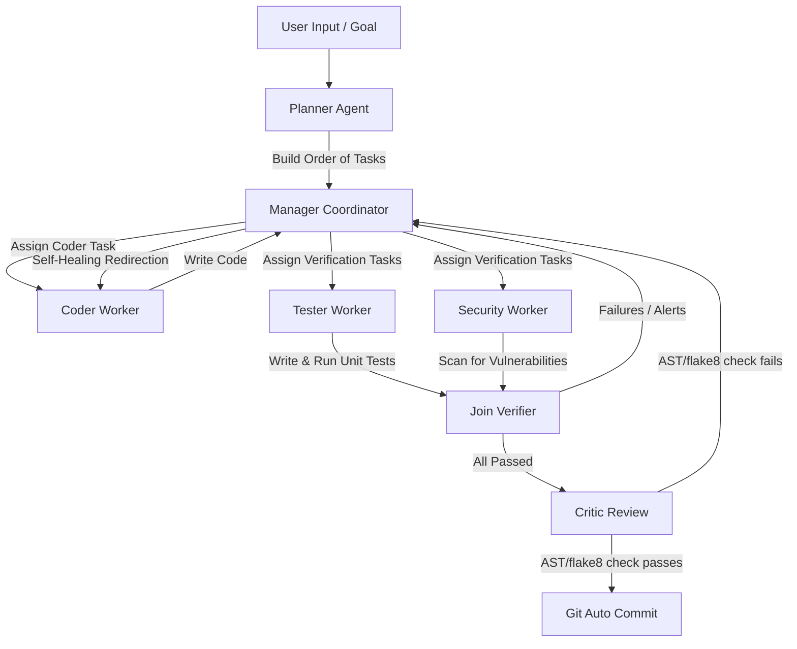

# ⚡ LLX: Autonomous Agentic IDE Kernel

[](https://fastapi.tiangolo.com/)
[](https://github.com/langchain-ai/langchain)
[](https://github.com/lancedb/lancedb)
[](https://code.visualstudio.com/)

**LLX** is a next-generation, autonomous, multi-agent AI-integrated development environment. It consists of a robust Python-based agentic orchestration kernel, an incremental semantic workspace indexing daemon, a built-in Cursor-style Web IDE, and a native VS Code Sidebar Extension. LLX enables developers to submit high-level development goals, which are decomposed, implemented, verified, style-reviewed, and committed autonomously.

---

## 📖 Table of Contents
- [✨ Key Features](#-key-features)
- [🏗️ System Architecture](#-system-architecture)
- [🚀 Getting Started](#-getting-started)
  - [Prerequisites](#prerequisites)
  - [Installation](#installation)
  - [Running the Backend Kernel](#running-the-backend-kernel)
  - [Running the Watchdog Daemon](#running-the-watchdog-daemon)
  - [Building the VS Code Extension](#building-the-vs-code-extension)
- [🔌 Built-in IDE Frontends](#-built-in-ide-frontends)
  - [1. Cursor-style Web IDE](#1-cursor-style-web-ide)
  - [2. VS Code Extension](#2-vs-code-extension)
- [🛠️ Core API Endpoints](#️-core-api-endpoints)
- [🧩 Dynamic Skill Registry (Plugins)](#-dynamic-skill-registry-plugins)
- [📜 License](#-license)

---

## ✨ Key Features

- **🧠 Multi-Agent LangGraph Orchestration**: Combines specialized AI workers (Planner, Manager, Coder, Tester, Security, and Critic) in a directed cyclic graph workflow.
- **🔄 Automated Self-Healing**: Tests and security scans run concurrently. Failures or security alerts are routed back to the Coder automatically with traceback context for self-correcting cycles.
- **🔍 Semantic Context Retrieval**: Automatically indexes codebase files incrementally into a serverless **LanceDB** database using HuggingFace embeddings (`all-MiniLM-L6-v2`), supplying the Planner with relevant context.
- **🗺️ Codebase Dependency Mapping**: Parses imports from Python (AST) and JavaScript/TypeScript (regex) to construct a localized codebase dependency graph.
- **🛡️ Real-time Security Audits**: Automated regex security scanners look for common vulnerabilities like `eval()`, `exec()`, `shell=True` subprocess calls, and hardcoded API keys.
- **🎨 Pluggable Skill System**: Dynamically discovers and loads external python skills (`BaseSkill`) into a sandboxed execution scope.
- **💻 Dual Interface Options**: Works out-of-the-box as a localhost-served Web IDE interface or a native VS Code activity bar sidebar webview.

---

## 🏗️ System Architecture

LLX uses a collaborative agentic workflow built on top of **LangGraph**. The workflow lifecycle proceeds as follows:



1. **Planner Agent**: Performs semantic search, builds dependency map, loads registered skills, and creates a task list.
2. **Manager Coordinator**: Orchestrates task routing, assigns items to workers, and monitors verification results.
3. **Coder Worker**: Focuses purely on writing the codebase implementation based on task definitions.
4. **Tester Worker**: Autonomously designs unit tests and runs them (e.g. `pytest`) to verify functionality.
5. **Security Worker**: Scans files for vulnerabilities (hardcoded credentials, unsafe executions).
6. **Critic Review**: Runs static analysis (`flake8`, `mypy`) to ensure a lint score of 10.0 before creating an automated git commit.

---

## 🚀 Getting Started

### Prerequisites
- Python 3.9 or higher
- Node.js (v16+) & npm (only required if building/running the VS Code Extension)
- Optional: `OPENAI_API_KEY` or `ANTHROPIC_API_KEY` set in env. If not set, LLX runs in **Mock Fallback Mode** for offline testability.

### Installation

1. **Clone the repository:**
   ```bash
   git clone https://github.com/amit14916-art/LLX.git
   cd LLX
   ```

2. **Configure Python virtual environment:**
   ```bash
   python -m venv .venv
   # On Windows (cmd/PowerShell):
   .venv\Scripts\activate
   # On macOS/Linux:
   source .venv/bin/activate
   ```

3. **Install dependencies:**
   ```bash
   pip install -r requirements.txt
   ```

### Running the Backend Kernel
Start the FastAPI server:
```bash
uvicorn app:app --reload --port 8000
```
The server will start at `http://127.0.0.1:8000/`.

### Running the Watchdog Daemon
To index your workspace and watch for local file changes dynamically:
```bash
python watchdog_daemon.py .
```
This runs in the background, updating the LanceDB database (`.lancedb/`) as you create or modify files.

### Building the VS Code Extension
If you want to package the VS Code extension for use:
```bash
python build.py
```
This script copy-bundles the Python kernel/skills into the extension folder, compiles TypeScript, and packages it into `agentic-ide-1.0.0.vsix` in your root directory.

---

## 🔌 Built-in IDE Frontends

### 1. Cursor-style Web IDE
Served directly from the FastAPI server at `http://localhost:8000/`.
- **Explorer**: Left sidebar file tree viewer.
- **Tabbed Editor**: Edit and save code files directly in the browser.
- **Integrated Terminal**: Execute commands on your host system directly from the web layout.
- **AI Sidebar**: Enter goals, watch logs stream in real-time, and run test suites.

### 2. VS Code Extension
Install the generated `.vsix` file in VS Code:
- Open VS Code.
- Go to Extensions (`Ctrl+Shift+X`).
- Click `...` in the top right -> **Install from VSIX...**
- Select the `agentic-ide-1.0.0.vsix` file.
- Add your Anthropic/OpenAI keys in VS Code Settings (`Agentic IDE Settings`).

---

## 🛠️ Core API Endpoints

- `POST /execute` - Initialize and stream the LangGraph execution output using Server-Sent Events (SSE).
- `GET /version` - Check local version and self-update status.
- `POST /update` - Self-update the kernel to the latest version by modifying local metadata.
- `GET /api/workspace` - Fetch current workspace folder details.
- `POST /api/terminal` - Run terminal commands inside the workspace directory.
- `WS /ws/logs` - Streaming WebSocket logs broadcast from the agent thread.
- `WS /metrics` - Streaming WebSocket telemetry data.

---

## 🧩 Dynamic Skill Registry (Plugins)

Developers can extend LLX capabilities by dropping custom Python classes into the `skills/` directory.

To create a new skill:
1. Create a Python file in `skills/` (e.g. `skills/format_code.py`).
2. Subclass `BaseSkill` and define the custom behavior:

```python
from kernel.skills import BaseSkill

class CodeFormatter(BaseSkill):
    def get_schema(self) -> dict:
        return {
            "name": "format_code",
            "description": "Formats Python files in the workspace.",
            "parameters": {
                "type": "object",
                "properties": {}
            }
        }

    def execute(self, state: dict) -> dict:
        # Run formatting operations
        return {"current_lint_score": 10.0}
```

---

## 📜 License

Distributed under the Apache License 2.0. See `LICENSE` for more information.